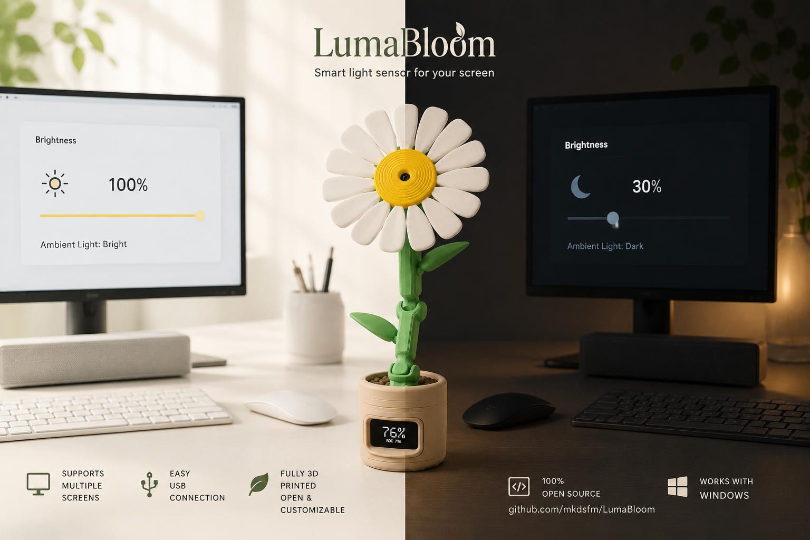

# LumaBloom

Smart ambient-light sensor for Windows displays, wrapped in a printable flower-shaped ESP32-C6 device.



<video src="hardware/3d-print/videos/demo.mp4" controls width="100%"></video>

[Watch the demo video](hardware/3d-print/videos/demo.mp4)

LumaBloom reads room light from a KY-018 sensor, calibrates the reading on an ESP32-C6, streams JSON telemetry over USB, and lets the Windows companion app adjust monitor brightness automatically.

## Highlights

- ESP32-C6 firmware for Waveshare `ESP32-C6-LCD-1.47`.
- Runtime calibration from the Windows app, with normalized `0..1000` telemetry.
- Live Windows terminal dashboard for status, calibration, manual brightness, settings, events, and diagnostics.
- Printable enclosure with `.3mf` plates, STEP sources, STL exports, photos, and demo media.
- User-tunable brightness curve, smoothing, hysteresis, gamma, language, and autostart settings.

## Project Map

| Path | Purpose |
| --- | --- |
| [`firmware/firmware_esp32c6/`](firmware/firmware_esp32c6/) | ESP-IDF firmware for the device |
| [`pc-app/`](pc-app/) | Windows-only .NET companion app |
| [`hardware/`](hardware/) | Wiring, BOM, assembly, printable enclosure, and hardware revisions |
| [`docs/`](docs/) | Protocol, profiles, setup, firmware, and build docs |

## Documentation

| Start here | What it covers |
| --- | --- |
| [`docs/getting-started.md`](docs/getting-started.md) | End-to-end setup from device to Windows app |
| [`docs/firmware.md`](docs/firmware.md) | ESP32-C6 firmware build, flash, monitor, and release binary notes |
| [`docs/build.md`](docs/build.md) | PC app restore, build, test, run, and publish commands |
| [`hardware/README.md`](hardware/README.md) | Hardware index, assembly, wiring, BOM, and enclosure assets |
| [`docs/protocol.md`](docs/protocol.md) | USB JSONL telemetry and calibration command contract |
| [`docs/device-profiles.md`](docs/device-profiles.md) | Built-in profile resolution and runtime defaults |
| [`CONTRIBUTING.md`](CONTRIBUTING.md) | Contribution workflow and validation expectations |

## How It Works

1. The ESP32-C6 reads the KY-018 sensor and shows status on the onboard LCD.
2. The Windows app discovers the device over a COM port.
3. The app samples raw light data and sends a `calibrate` command with the current monitor brightness.
4. The device starts streaming calibrated normalized readings.
5. The app maps ambient light to monitor brightness using the configured curve and smoothing settings.

Telemetry example:

```json
{"deviceId":"esp32c6-01","sensorId":"light0","ts":1234567,"value":742,"raw":1840,"calibrated":true}
```

## Current Target

- Board: Waveshare `ESP32-C6-LCD-1.47`
- Sensor: KY-018 analog light sensor
- Desktop app: Windows 10/11
- Firmware: ESP-IDF
- App runtime: .NET SDK 10.0+

## License

Repository code and documentation use the root repository license.

Custom physical enclosure assets in [`hardware/3d-print/`](hardware/3d-print/) are licensed separately under `CC BY-NC 4.0`; see [`hardware/3d-print/LICENSE.md`](hardware/3d-print/LICENSE.md).
