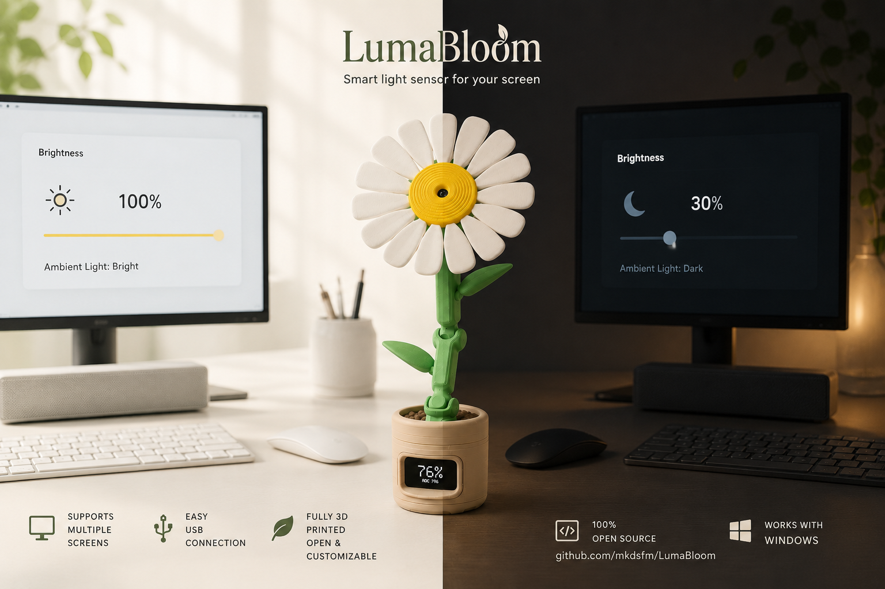

# LumaBloom

Smart ambient-light sensor for Windows displays with ESP32-C6 and displayless ESP32-C3 Super Mini electronics variants for the same printable flower design.



[Watch the demo video](https://youtu.be/8JuLW-chpVk?si=8Hq7ECl7L5f6ZxNs)

LumaBloom reads room light from a KY-018 sensor on a supported ESP32 board, streams raw JSON telemetry over USB, and lets the Windows companion app adjust monitor brightness automatically.

## Highlights

- ESP32-C6 firmware for Waveshare `ESP32-C6-LCD-1.47` with an ambient-light-driven pixel-art flower animation.
- Displayless ESP32-C3 Super Mini firmware for a compact `KY-018` USB sensor.
- Raw `ADC` telemetry on both hardware tracks, with normalization handled by the Windows app and, for display only, locally by the ESP32-C6 UI.
- Live Windows terminal dashboard for status, manual brightness, settings, events, and diagnostics.
- In-app firmware updates with automatic COM-port selection and a refreshed manual port dropdown.
- Shared printable flower enclosure with `.3mf` plates, STEP sources, STL exports, photos, and demo media; the ESP32-C3-specific lower pot is not available yet.
- User-tunable brightness curve, including anchoring the curve to the current room light, plus smoothing, hysteresis, gamma, language, and autostart settings.

## Project Map

| Path | Purpose |
| --- | --- |
| [`firmware/`](firmware/) | ESP-IDF firmware projects for ESP32-C6 and ESP32-C3 Super Mini |
| [`pc-app/`](pc-app/) | Windows-only .NET companion app |
| [`hardware/`](hardware/) | Wiring, BOM, assembly, printable enclosure, and hardware revisions |
| [`docs/`](docs/) | Protocol, settings, setup, firmware, and build docs |

## Documentation

| Start here | What it covers |
| --- | --- |
| [`docs/getting-started.md`](docs/getting-started.md) | End-to-end setup from device to Windows app |
| [`docs/firmware.md`](docs/firmware.md) | ESP32-C6 and ESP32-C3 firmware build, flash, monitor, and release notes |
| [`docs/build.md`](docs/build.md) | PC app restore, build, test, run, and publish commands |
| [`hardware/README.md`](hardware/README.md) | Hardware index, assembly, wiring, BOM, and enclosure assets |
| [`docs/protocol.md`](docs/protocol.md) | USB JSONL telemetry contract |
| [`docs/sensor-transports-and-monitor-ddc.md`](docs/sensor-transports-and-monitor-ddc.md) | Sensor transport and monitor DDC/CI brightness control docs, with English and Russian variants |
| [`docs/device-profiles.md`](docs/device-profiles.md) | Single-device runtime defaults and settings model |
| [`CONTRIBUTING.md`](CONTRIBUTING.md) | Contribution workflow and validation expectations |

## How It Works

1. The ESP32 board reads the KY-018 sensor; the ESP32-C6 build also visualizes ambient light on its onboard LCD.
2. The Windows app discovers the device over a COM port.
3. The device streams raw light telemetry over USB.
4. The app maps ambient light to monitor brightness using the active settings, response curve, and smoothing settings.
5. On the ESP32-C6 track, the LCD shows a local normalized percentage derived from the configured raw range; the ESP32-C3 track has no display.

Telemetry example:

```json
{"id":"lumabloom","ts":1234567,"raw":1840}
```

## Supported Targets

- Waveshare `ESP32-C6-LCD-1.47` or touch variant with onboard LCD: [`firmware/firmware_esp32c6/`](firmware/firmware_esp32c6/)
- `ESP32-C3 Super Mini` with built-in USB Serial/JTAG and no display: [`firmware/firmware_esp32c3_supermini/`](firmware/firmware_esp32c3_supermini/)
- Sensor: KY-018 analog light sensor on either track
- Desktop app: Windows 10/11
- Firmware: ESP-IDF
- App runtime: .NET SDK 10.0+

## License

Repository code and documentation use the root repository license.

Custom physical enclosure assets in [`hardware/3d-print/`](hardware/3d-print/) are licensed separately under `CC BY-NC 4.0`; see [`hardware/3d-print/LICENSE.md`](hardware/3d-print/LICENSE.md).
