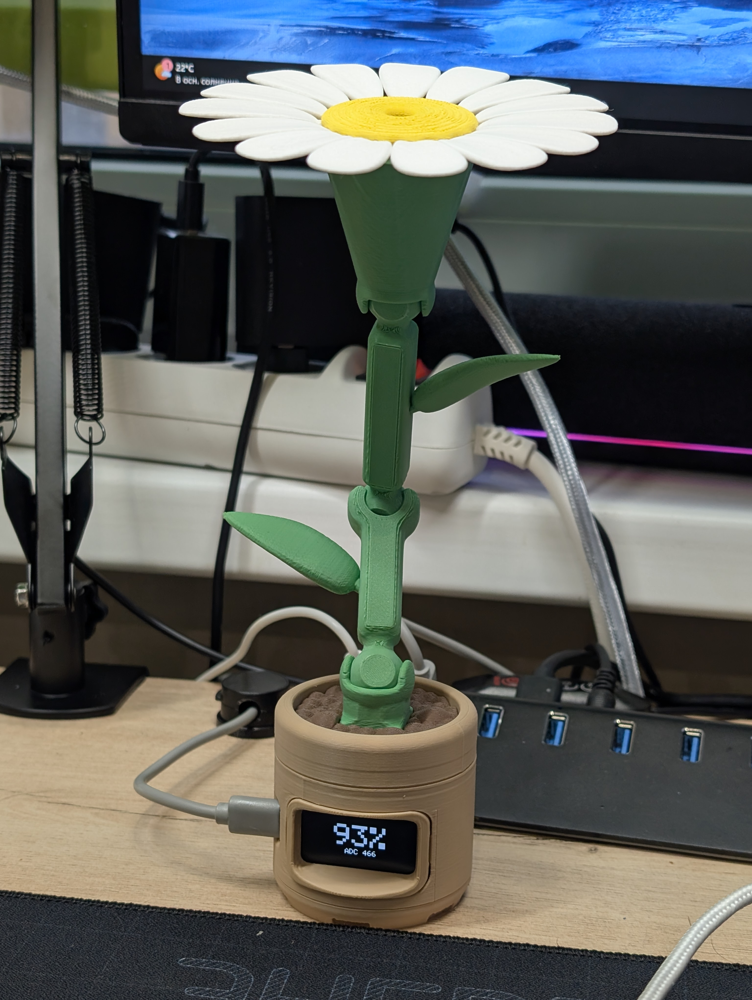

# Hardware

This section contains the physical-device materials for `brightness-sensor`: wiring, component notes, assembly checks, and the printable LumaBloom ESP32-C6 enclosure.

## Sections

| Path | Purpose |
| --- | --- |
| [`WIRING.md`](WIRING.md) | KY-018 wiring for the supported ESP32-C6 hardware track |
| [`BOM.md`](BOM.md) | Bill of materials for the current supported builds |
| [`ASSEMBLY.md`](ASSEMBLY.md) | ESP32-C6 enclosure assembly steps and smoke checks |
| [`REVISIONS.md`](REVISIONS.md) | Hardware revision log |
| [`3d-print/`](3d-print/) | Printable LumaBloom enclosure notes |
| [`3d-print/enclosure/`](3d-print/enclosure/) | Slicer-ready `.3mf` plates grouped by color |
| [`3d-print/images/`](3d-print/images/) | Product preview and per-color print reference images |
| [`3d-print/source/`](3d-print/source/) | STEP source models and selected STL exports |
| [`3d-print/LICENSE.md`](3d-print/LICENSE.md) | License notes for physical-design assets |

## Supported Hardware Track

### Waveshare ESP32-C6-LCD-1.47 + KY-018

- Board: Waveshare `ESP32-C6-LCD-1.47`.
- Sensor: KY-018 analog light sensor.
- Display: onboard ST7789 LCD.
- Firmware: ESP-IDF project in `firmware/firmware_esp32c6/`.
- Telemetry value: calibrated normalized reading in the `0..1000` range, with optional `raw`.

## Notes

- The current printable LumaBloom enclosure assembly is documented for the ESP32-C6 build only.
- Custom 3D-print enclosure assets are licensed under `CC BY-NC 4.0`; see [`3d-print/LICENSE.md`](3d-print/LICENSE.md).
- Do not use `GPIO0` for the KY-018 signal on ESP32-C6; it can interfere with normal startup.
- For PC application behavior, calibration, and telemetry details, see `docs/protocol.md` and `docs/device-profiles.md`.
