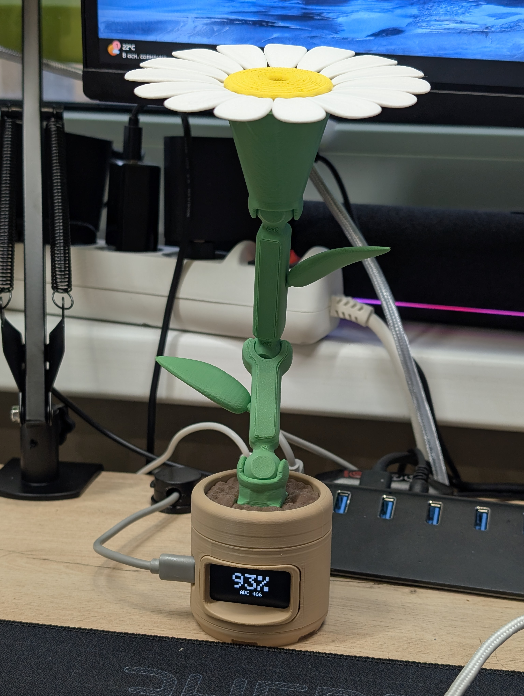

# Hardware

This section contains wiring and component notes for both supported boards plus assembly checks and the printable LumaBloom flower enclosure.

## Sections

| Path | Purpose |
| --- | --- |
| [`WIRING.md`](WIRING.md) | KY-018 wiring for the ESP32-C6 and ESP32-C3 hardware tracks |
| [`BOM.md`](BOM.md) | Bill of materials for the current supported builds |
| [`ASSEMBLY.md`](ASSEMBLY.md) | Shared flower assembly, ESP32-C6 pot assembly, and smoke checks |
| [`REVISIONS.md`](REVISIONS.md) | Hardware revision log |
| [`3d-print/`](3d-print/) | Printable LumaBloom enclosure notes |
| [`3d-print/enclosure/`](3d-print/enclosure/) | Slicer-ready `.3mf` plates grouped by color |
| [`3d-print/images/`](3d-print/images/) | Product preview and per-color print reference images |
| [`3d-print/source/`](3d-print/source/) | STEP source models and selected STL exports |
| [`3d-print/LICENSE.md`](3d-print/LICENSE.md) | License notes for physical-design assets |

## Supported Hardware Track

### Waveshare ESP32-C6-LCD-1.47 + KY-018

- Board: Waveshare `ESP32-C6-LCD-1.47`.
- Sensor: KY-018 analog light sensor.
- Display: onboard ST7789 LCD.
- Firmware: ESP-IDF project in `firmware/firmware_esp32c6/`.
- Telemetry value: raw ADC reading over USB; normalized percent stays local to the device LCD and app processing.

### ESP32-C3 Super Mini + KY-018

- Board: ESP32-C3 Super Mini with built-in USB Serial/JTAG exposed on USB.
- Sensor: KY-018 analog light sensor on `GPIO4` (`ADC1_CH4`).
- Display: none.
- Firmware: ESP-IDF project in `firmware/firmware_esp32c3_supermini/`.
- Telemetry value: native 12-bit ADC reading over USB; normalization remains in `pc-app`.

## Notes

- The flower, sensor holder, stem, joints, petals, and leaves are shared by the ESP32-C6 and ESP32-C3 builds.
- The lower pot assembly depends on the board. The repository currently contains the ESP32-C6 pot; the ESP32-C3 Super Mini pot has not been modeled or published yet.
- A complete ESP32-C3 enclosure cannot be printed from the current files until its pot and board-mounting parts are added.
- Custom 3D-print enclosure assets are licensed under `CC BY-NC 4.0`; see [`3d-print/LICENSE.md`](3d-print/LICENSE.md).
- Do not use `GPIO0` for the KY-018 signal on ESP32-C6; it can interfere with normal startup.
- For PC application behavior, calibration, and telemetry details, see `docs/protocol.md` and `docs/device-profiles.md`.
